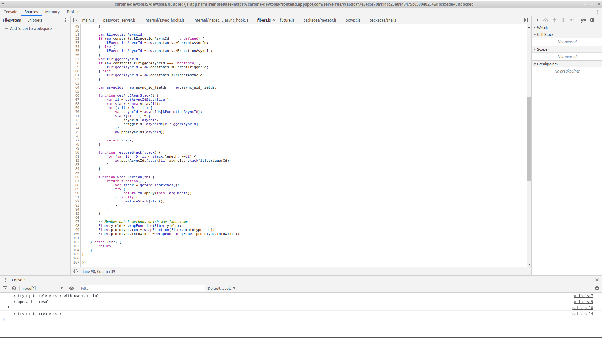

# DEMO ONLY

This is a fork for bug demonstration only.

Application silently crashes when Accounts#createUser is called.

Manual debugging shows that Meteor's Future fails to resolve result from previously called `bcrypt.hash` function. See line 90 at [debugger snapshot](img/snapshot.png).



Steps to reproduce:

1. Run `docker-compose up --build -d` from `/example` directory. Note that app can start too early to connect to MongoDB with success, so just restart its container if app hangs up.
2. Open [app root](http://localhost) in the browser.
3. Click on the "Recreate user" button.

That's it. App successfully crashed. 😊

Crashed container log does not contain line:
```
---> user created with id: <some_mongo_id>
```

You can debug this app's server code by adding `debugger` word where you need a breakpoint.
Also see [breakpoint](example/app/server/main.js) at line 12 used to make [snapshot](img/snapshot.png).

You can patch this bug by `meteor npm uninstall bcrypt` command.
Thus Meteor will use pure JS bcrypt instead of native C++ version.

It seems that the build pipeline of the base Docker image was broken somewhere.

# Base Docker Image for Meteor Apps

This repo contains a base Docker image for use by [Meteor](https://www.meteor.com/) apps built using a [multistage Dockerfile](https://docs.docker.com/develop/develop-images/multistage-build/). You might want to use this base because:

- You can build/bundle your Meteor app as part of building your Docker image, rather than outside of Docker before the Docker build. This means the machine doing the building need not have Node or Meteor installed, which is important for continuous integration setups; and ensures repeatable builds, since the build environment is isolated and controlled.

- Using a multistage `Dockerfile` on your app’s side means that you can publish a much smaller final Docker image that doesn’t have Meteor included, and you can also use an Alpine Linux base which is good for passing security scans (as it presents much less surface area in which scanners might find vulnerabilities).

## Quickstart

Copy `example/default.dockerfile` (or `example/app-with-native-dependencies.dockerfile` if your app has native dependencies that require compilation or if your app is using a version of Meteor older than 1.8.1) into the root of your project and rename it `Dockerfile`. This file assumes that your Meteor app is one level down from the root in a folder named `app`; either move your app there, or edit `Dockerfile` to point to your desired path (or the root of your project). Leave `Dockerfile` at the root.

Also copy in `example/.dockerignore` and `example/docker-compose.yml` to your project’s root. Then, from the root of your project:

```bash
docker-compose up
```

This builds an image for your app and starts it, along with a linked container for MongoDB. Go to [http://localhost/](http://localhost/) to see your app running.

Feel free to edit the `Dockerfile` you copied into your project, for example to add Linux dependencies. The beauty of the multistage build pattern is that this base image can stay lean, without needing `ONBUILD` triggers or configuration files for you to influence the image that gets built. You control the final image via your own `Dockerfile`, so you can do whatever you want.

## Why this image, instead of some others?

There are several great Meteor Docker images out there. We built this one because none of the existing open source ones met our needs:

- [jshimko/meteor-launchpad](https://github.com/jshimko/meteor-launchpad) is great, but it’s based on `debian:jessie`, which fails the security scan we run on all of our Docker images. Debian is also larger than Alpine. This project also always downloads and installs Meteor on every production build, rather than caching it as this base image does.

- [meteor/galaxy-images](https://github.com/meteor/galaxy-images) and [Treecom/meteor-alpine](https://github.com/Treecom/alpine-meteor) both require building the Meteor app in the host machine, before copying the built app into the Docker container. We wanted to avoid needing Node and Meteor installed on our CI servers, and we want the predictability of building within the Docker environment.

Other projects I looked at generally had one or more of the disadvantages cited above. Multistage Docker builds have only been possible since Docker 17.05, which came out in May 2017, and most projects on the Web were designed before then and therefore don’t take advantage of the possibilities offered by a multistage architecture.
